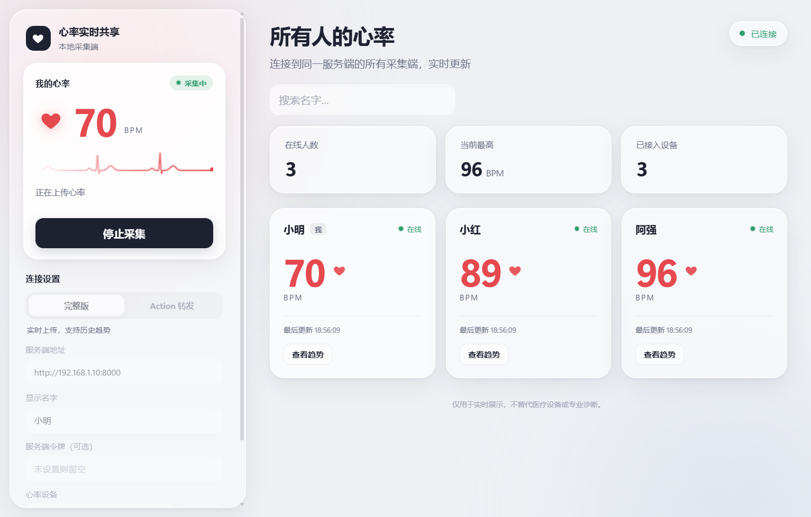

# 心率实时共享

把手表或心率带上的实时心率，共享给队友和直播间观众。

Windows 采集端通过蓝牙读取标准 BLE 心率设备，上传到你自己部署的服务端；队友打开采集端窗口，观众打开网页，就能同屏看到所有人的实时 BPM、在线状态和最近 30 分钟的心率趋势。



## 为什么做这个

打游戏和直播的时候，心率是一种很直接的“情绪指标”：团战前的紧张、恐怖游戏里的惊吓、决胜局最后几秒，数字会比表情更诚实。观众喜欢看，队友之间互相看也很有意思。

真正动手时，我们发现现有方案有几个问题：

- **数据要交给别人。** 常见的心率展示工具，多半要先把心率上传到厂商或第三方的云服务，再从那里取回来显示。心率是健康数据，我们希望它只经过自己的服务器。
- **一次只能看一个人。** 大多数工具是为单个主播设计的，没法让一队人的心率放在同一个画面里对比。
- **被设备品牌绑住。** 每个人的手表、心率带品牌不同，各家 App 互不相通。

所以这个项目的原则很简单：**服务端自己部署，数据自己掌控；只要设备支持标准心率广播，就能接进来；所有人同屏显示。**

## 它能做什么

- **多人实时同屏**：每个人一张卡片，显示实时 BPM、在线状态和最后更新时间；心形图标按各自的实时心率跳动。
- **心率趋势**：点击“查看趋势”，查看任意一个人最近 5 / 15 / 30 分钟的心率曲线。
- **采集端自带看板**：采集端窗口左侧是自己的心率和一条跟着心跳滚动的心电图，右侧就是全员看板，不用另开浏览器。
- **网页看板**：服务端同时提供网页，观众或其他设备用浏览器打开即可，不需要安装任何东西。
- **不挑设备品牌**：支持所有广播标准 BLE Heart Rate Service（`0x180D`）的设备，在采集端里扫描、从列表中选择即可。
- **自动恢复**：网络或蓝牙断开后，采集端会自动重连；服务端 20 秒收不到某人的数据就把他标记为离线。
- **免安装**：采集端打包成一个约 14 MB 的 exe，双击就能运行。

## 工作原理

```text
 心率设备 ──蓝牙 BLE──▶ 采集端（Windows）──WebSocket──▶ 服务端（你自己部署）──WebSocket──▶ 网页看板 / 采集端看板
                                                          │
                                                          └──▶ SQLite（历史趋势）
```

- **采集端**（`client/`）订阅设备的心率通知，每收到一次心率就立刻上传，并每 5 秒发一次心跳，让服务端知道自己还在线。
- **服务端**（`server/`，FastAPI）在内存里维护所有人的最新状态，把每个心率样本写入 SQLite；任何人的状态一变化，就把完整名单推送给所有看板。
- **看板**（`web/`）是纯 HTML / CSS / JavaScript，不需要构建。采集端窗口右侧的看板和网页用的是同一份代码。

每个采集端第一次运行时会生成一个固定的身份 ID，保存在本机，所以改名字不会丢失历史记录。

## 快速开始

### 1. 部署服务端（由一个人负责）

需要 Python 3.10 及以上。在一台大家都能访问到的电脑或服务器上运行：

```powershell
pip install -r requirements-server.txt
python -m uvicorn server.app:app --host 0.0.0.0 --port 8000
```

然后浏览器打开 <http://127.0.0.1:8000/> 就能看到看板。局域网内的其他人用这台电脑的局域网 IP 访问，例如 `http://192.168.1.10:8000/`。

如果服务端要放到公网上，建议设置一个共享令牌，并放在带 HTTPS 的反向代理之后（代理需要转发 `/ws/ingest` 和 `/ws/monitor` 的 WebSocket 升级请求）：

```powershell
$env:HR_SERVER_TOKEN = "请替换成随机长令牌"   # 采集端和网页都要填写同一个令牌
python -m uvicorn server.app:app --host 0.0.0.0 --port 8000
```

### 2. 每个人运行采集端

1. 在 [Releases](../../releases/latest) 下载 `HeartRateCollector.exe`，双击运行。
2. 在左侧填写**服务端地址**（例如 `http://192.168.1.10:8000`）和**显示名字**；服务端设置了令牌时，再填写**服务端令牌**。
3. 戴好设备，点击**扫描**，在下拉框里选择自己的设备（带 ❤ 的是广播标准心率服务的设备）。
4. 点击**开始采集**。

运行要求：Windows 10 / 11，电脑蓝牙已开启。采集端界面基于 Edge WebView2，Windows 11 自带；如果在 Windows 10 上打开后窗口一直空白，先安装 [WebView2 运行时](https://developer.microsoft.com/microsoft-edge/webview2/)。exe 没有代码签名，首次运行时 Windows 可能提示“已保护你的电脑”，点击“更多信息 → 仍要运行”即可。

采集端同一时间只能开一个窗口，再次打开会切换到已经打开的那个窗口。

### 3. 在直播里展示

网页看板就是一个普通网页，可以在 OBS 里添加“浏览器源”，地址填服务端地址（例如 `http://192.168.1.10:8000/`），再按需要裁剪画面。设置了令牌的话，在 OBS 里右键浏览器源选择“交互”，在弹出的窗口里填写一次令牌即可（OBS 的浏览器源和你平时用的浏览器是分开保存的）。

目前看板是完整页面（包含标题、搜索框等），还没有专门为直播设计的透明叠加层，见下方“已知限制”。

## 支持的设备

任何广播标准 BLE Heart Rate Service（UUID `0x180D`）的设备都可以使用：

- **心率带**：大多数运动心率胸带默认就广播标准心率服务。
- **智能手表**：通常要先在手表的设置里打开“心率广播”（名称因品牌而异），开启后才会出现在扫描列表中。我们用 OPPO Watch 实测可用。

扫描不到设备时，最常见的原因是手机上的运动 App 正连着它：同一时间通常只允许一个设备连接，先在手机上断开即可。

## 数据去向与隐私

“数据自己掌控”是这个项目的出发点，下面列出心率数据会经过和保存的所有位置：

| 位置 | 保存什么 | 保存多久 |
| --- | --- | --- |
| 采集端电脑 | 服务端地址、显示名字、令牌、选中的设备（`.heart-rate-sharing.json`）和运行日志（`.heart-rate-sharing.log`），都在用户目录下；**不保存心率** | 直到手动删除 |
| 服务端内存 | 每个人的最新心率和在线状态 | 服务端运行期间 |
| 服务端 SQLite | 每个心率样本（时间、BPM）和显示名字，默认在 `data/heart_rate.db` | **一直保留，没有自动清理**，需要时手动删除数据库文件 |
| 看板（网页 / 采集端） | 只显示，不保存；网页会在浏览器里记住你填写的令牌 | — |

直连服务端时，心率不会经过任何第三方。唯一的例外是下文的 Action 转发方式：数据会经过 GitHub 的工作流。

公网部署时请使用 HTTPS / WSS 和强随机令牌，并限制服务器与数据库的访问范围。本项目仅用于实时展示，不替代医疗设备或专业诊断。

## 另一种方式：GitHub Actions 转发

如果采集端无法直接连到服务端（例如处在无法开放端口的网络里），可以改用 GitHub Actions 转发：采集端每 60 秒通过 `repository_dispatch` 提交一次最新值，工作流再把它转发给一个只在内存里保存最新状态的轻量接收端（`relay/`）。

```text
采集端 → repository_dispatch → GitHub Actions → 轻量接收端 → 网页 / 采集端看板
```

这种方式延迟较高（至少 60 秒，还要加上 GitHub 排队时间），也没有历史趋势，只适合临时使用。部署接收端、配置仓库 Secrets 和采集端的步骤见 [docs/actions.md](docs/actions.md)。

## 配置参考

| 配置 | 使用位置 | 作用 |
| --- | --- | --- |
| `HR_SERVER_TOKEN` | 服务端；轻量接收端 | 采集和查看都需要的共享令牌（可选） |
| `HR_DB_PATH` | 服务端 | SQLite 数据库文件路径，默认 `data/heart_rate.db` |
| `HR_RELAY_TOKEN` | 轻量接收端 | 保护 `/api/relay` 写入接口 |
| `HR_GITHUB_TOKEN` | 采集端（Action 转发） | 也可以直接在采集端界面里填写 GitHub 令牌 |
| `RELAY_TARGET_URL` | GitHub Actions Secret | 接收端的 HTTPS `/api/relay` 地址 |
| `RELAY_TARGET_TOKEN` | GitHub Actions Secret | 与 `HR_RELAY_TOKEN` 相同 |

环境变量只在设置它的 PowerShell 窗口里生效；长期使用请改成系统环境变量。

## 排错

- **扫描不到设备**：确认设备已开启心率广播，并断开手机上正在连接它的运动 App；电脑蓝牙要处于开启状态。
- **扫描失败或超时**：界面会显示原因。反复出现时，点击采集端左下角的“打开日志文件夹”，把 `.heart-rate-sharing.log` 发给维护者。
- **看板显示“令牌无效”**：采集端、网页和服务端的 `HR_SERVER_TOKEN` 不一致。
- **看板一直显示“正在连接”**：服务端地址填错，或服务端所在电脑的防火墙拦截了端口。
- **没有趋势图**：趋势只在直连服务端时可用，并且要先上传过一段时间的心率；Action 转发方式不保存历史。
- **反向代理后网页不刷新**：检查代理是否转发了 WebSocket 的 `Upgrade` / `Connection` 请求头。

## 已知限制

- 采集端只支持 Windows。
- 服务端保存的心率历史不会自动清理，长期运行后需要手动删除或迁移数据库。
- 网页看板还没有专门给直播用的透明叠加层或精简模式。
- exe 没有代码签名，首次运行会被 Windows SmartScreen 提示。

## 开发

```text
client/    Windows 采集端：core.py 负责蓝牙和上传，app.py 是 pywebview 窗口，ui/ 是界面
server/    服务端（FastAPI + SQLite）
relay/     Action 转发用的轻量接收端（只在内存里保存）
web/       网页看板；采集端右侧的看板也复用这里的 app.js 和 styles.css
scripts/   build_exe.ps1 打包采集端；relay_action.py 由 GitHub 工作流调用
docs/      Action 转发说明和截图
```

从源码运行采集端：

```powershell
pip install -r requirements.txt
python client/app.py
```

打包 exe（输出到 `dist\HeartRateCollector.exe`）：

```powershell
powershell -ExecutionPolicy Bypass -File scripts\build_exe.ps1
```

提交前的检查：

```powershell
python -m compileall -q server relay client scripts
node --check web/app.js
node --check client/ui/desktop.js
```

### 通信协议

采集端连接 `WS /ws/ingest`，第一条消息必须是注册，之后发送心率和心跳：

```json
{"type":"register","client_id":"local-id","name":"小明","token":""}
{"type":"heart_rate","heart_rate":82}
{"type":"heartbeat"}
```

看板连接 `WS /ws/monitor?token=...`，每次有人状态变化时，服务端推送完整名单：

```json
{"type":"snapshot","people":[{"client_id":"local-id","name":"小明","heart_rate":82,"online":true,"last_seen":"2026-09-09T12:00:00+00:00"}]}
```

历史趋势：`GET /api/people/{client_id}/history?minutes=5|15|30`，设置了令牌时需要带上 `Authorization: Bearer <令牌>`。

## 许可证

[MIT](LICENSE)
